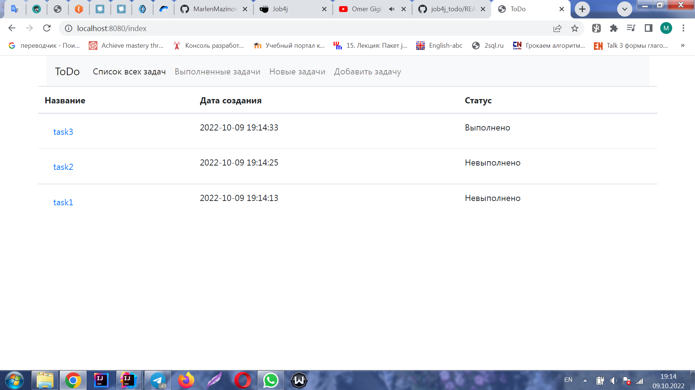
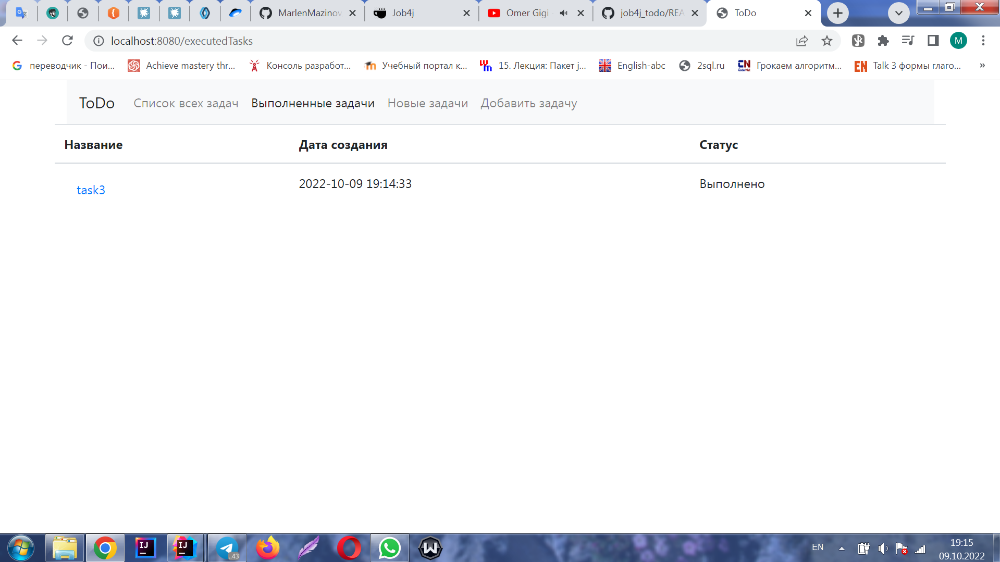
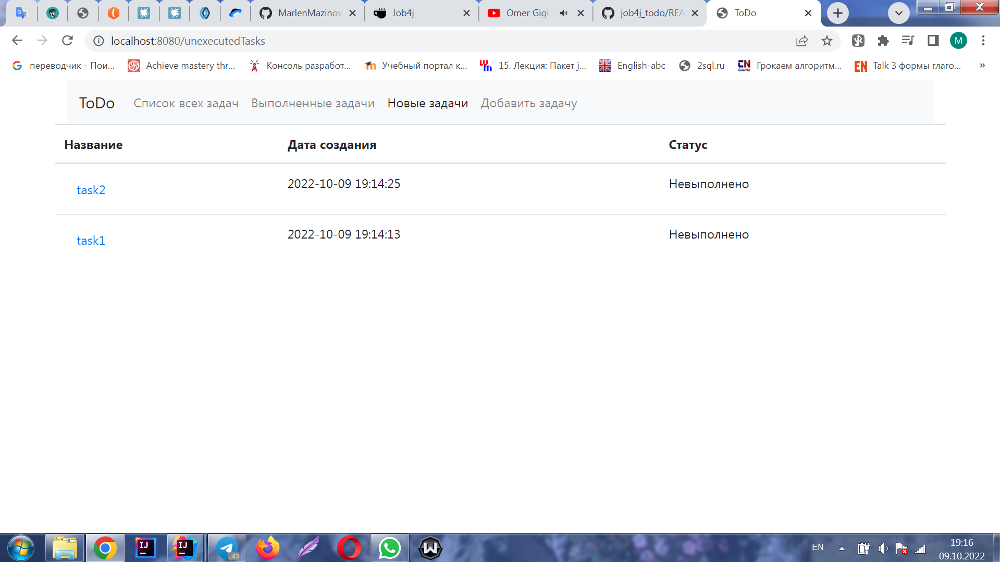
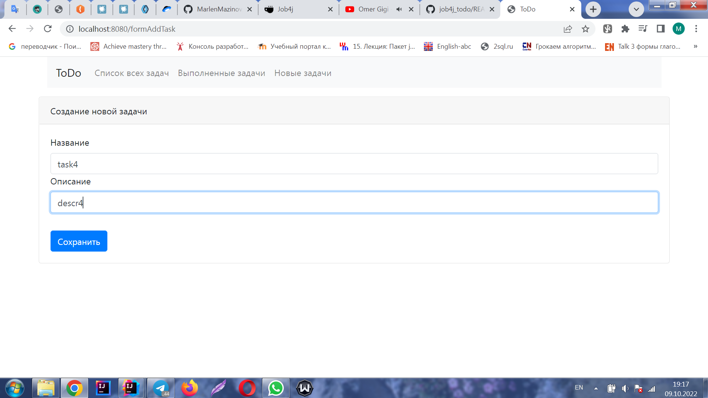
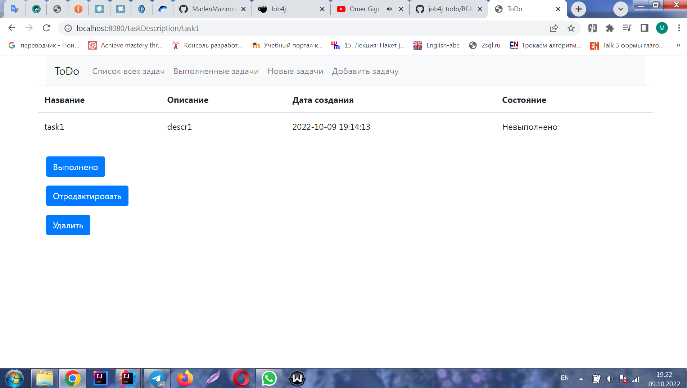

В данном проекте будет разработано приложение для работы с задачами, имеющее следующий функционал:
1. Вывод на главной странице списка всех задач

2. Вывод списка выполненных задач на отдельной странице

3. Вывод списка невыполненных задач на отдельной странице

4. Создание новой задачи

5. Подробное описание каждой задачи с дополнительными функциями (изменение статуса задачи 
на "Выполнено", редактирование задачи и удаление)

6. Редактирование задачи

В проекте используются следующий стек технологий: 
Spring boot, Thymeleaf, Bootstrap, Hibernate, Liquibase, Lombok, PostgreSql.