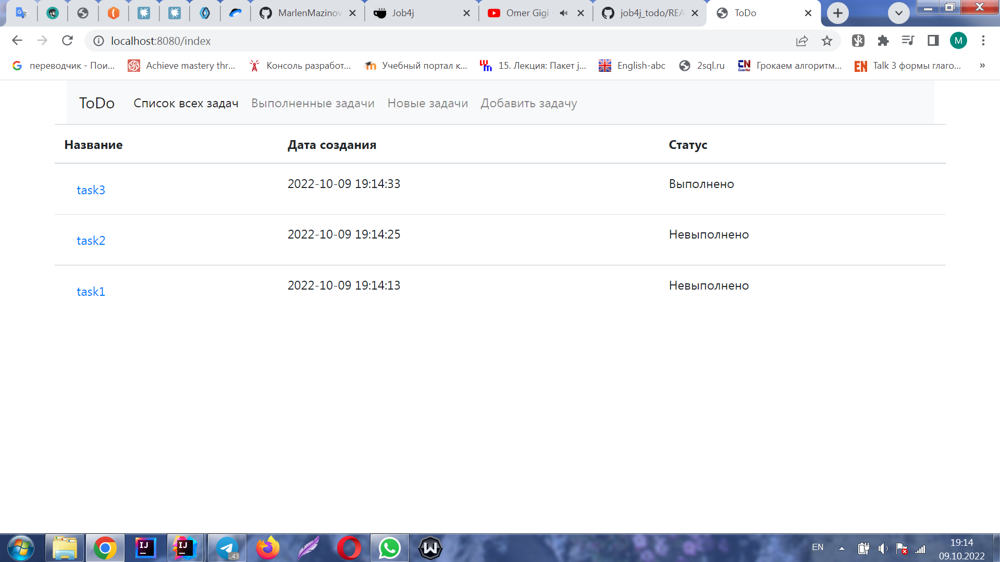
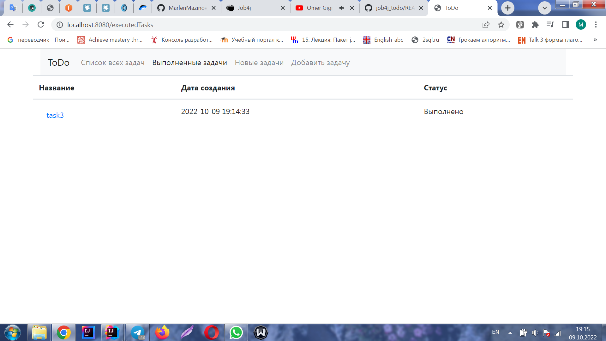
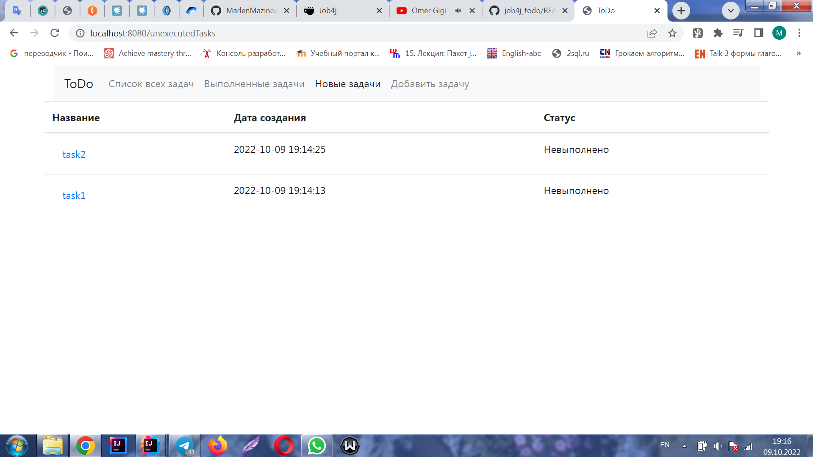
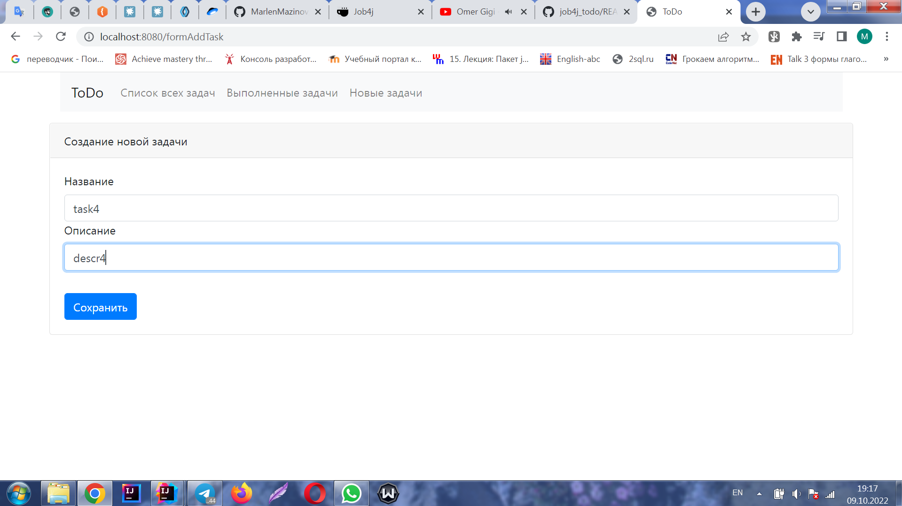
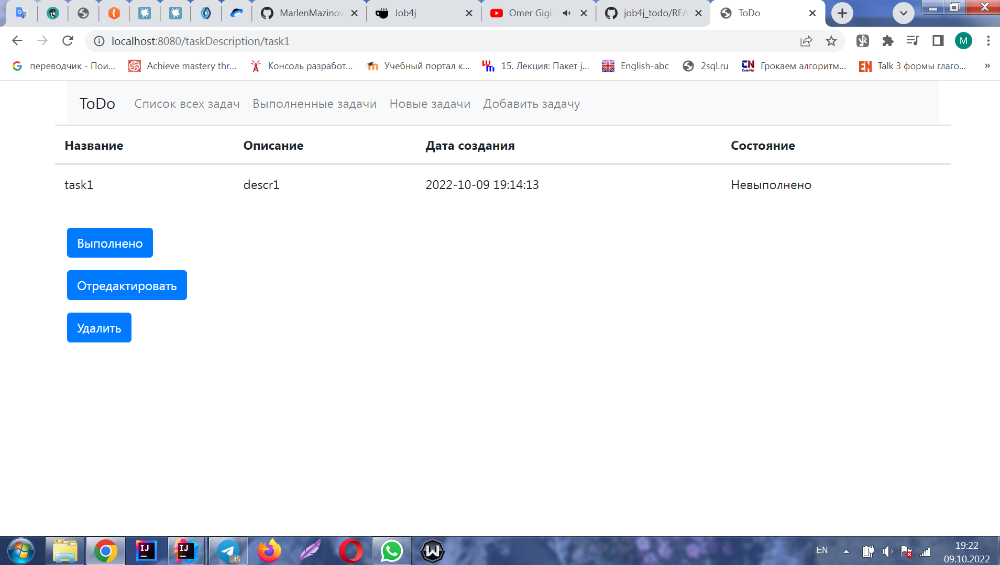

В данном проекте будет разработано приложение для работы с задачами, имеющее следующий функционал:

Вывод на главной странице списка всех задач

Вывод списка выполненных задач на отдельной странице

Вывод списка невыполненных задач на отдельной странице

Создание новой задачи

Подробное описание каждой задачи с дополнительными функциями (изменение статуса задачи
на "Выполнено", редактирование задачи и удаление)

Редактирование задачи

В проекте используются следующий стек технологий:
Apache Maven 3.8.4 
Spring boot 2.7.3
Thymeleaf
Bootstrap 4.4.1
Hibernate 5.6.11
Liquibase 3.6.2
Lombok 1.18.22
PostgresSql (dependency) 42.2.9

Для запуска приложения на устройстве должно быть установлено и настроено следующее окружение:
1. установлены JDK, Maven, сервер БД Postgres (имя пользователя и пароль - postgres
   и password соответствено)
2. выполнена настройка окружения для Maven и JDK

Для запуска приложения необходимо выполнить следующие действия:
1. создать БД с именем todo (используя сервер БД PostgresSql) 
2. перейти в каталог job4j_todo
3. выполнить команду mvn spring-boot:run.